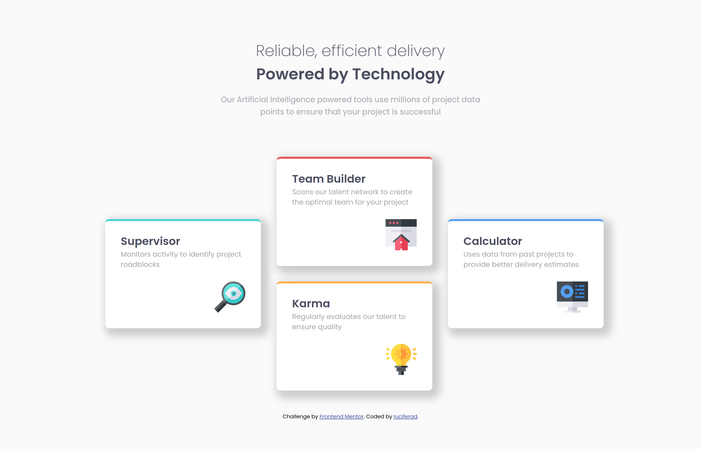

# Frontend Mentor - Four card feature section solution

This is a solution to the [Four card feature section challenge on Frontend Mentor](https://www.frontendmentor.io/challenges/four-card-feature-section-weK1eFYK). Frontend Mentor challenges help you improve your coding skills by building realistic projects. 

## Table of contents

- [Overview](#overview)
  - [The challenge](#the-challenge)
  - [Screenshot](#screenshot)
  - [Links](#links)
- [My process](#my-process)
  - [Built with](#built-with)
  - [What I learned](#what-i-learned)
  - [Continued development](#continued-development)
  - [Useful resources](#useful-resources)
- [Author](#author)

## Overview

### The challenge

Users should be able to:

- View the optimal layout for the site depending on their device's screen size

### Screenshot



### Links

- Solution URL: [Github](https://github.com/luciferad/four-card-feature-section-master.git)
- Live Site URL: [Github](https://luciferad.github.io/four-card-feature-section-master)

## My process

### Built with

- Semantic HTML5 markup
- CSS custom properties
- Flexbox
- CSS Grid
- Mobile-first workflow

### What I learned

I designed this page base on mobile-first workflow for the first time. I used _<section>_ instead of _<div>_ in the main body of the page.
I've figured out that when I have some _<div>_ or _<section>_ in a container, I can simply use **_{display: grid}_** for the container without specifying any tracks. Then every _<div>_ or _<section>_ assigns to a grid area automatically.

```html
<main>
  <section></section>
  <section></section>
</main>
```
```css
main {
  display: grid;
}
```

### Continued development

I have to learn more about HTML & CSS. I should code more optimized & practice more for better layout.

### Useful resources

- [Learning Web Design](https://www.amazon.com/Learning-Web-Design-Beginners-JavaScript/dp/1491960205) - A great book for begining.
- [W3Schools](https://www.w3schools.com/) - A handy reference for learning frontend.

## Author

- Github - [@luciferad](https://github.com/luciferad)
- Frontend Mentor - [@luciferad](https://www.frontendmentor.io/profile/luciferad)